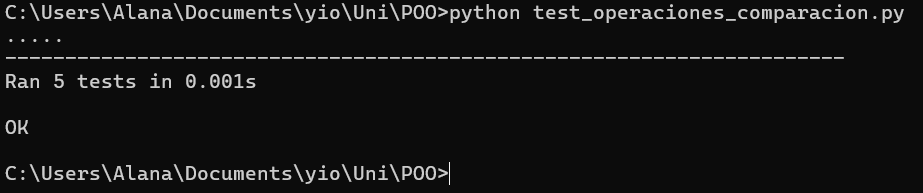

 Pruebas Unitarias con Comparación en Python

Este repositorio contiene:

- `operaciones_comparacion.py`: `test_operaciones_comparacion.py`: pruebas usando `unittest`.

## Archivo de pruebas ejecutado en el cmd 
- 
- 
